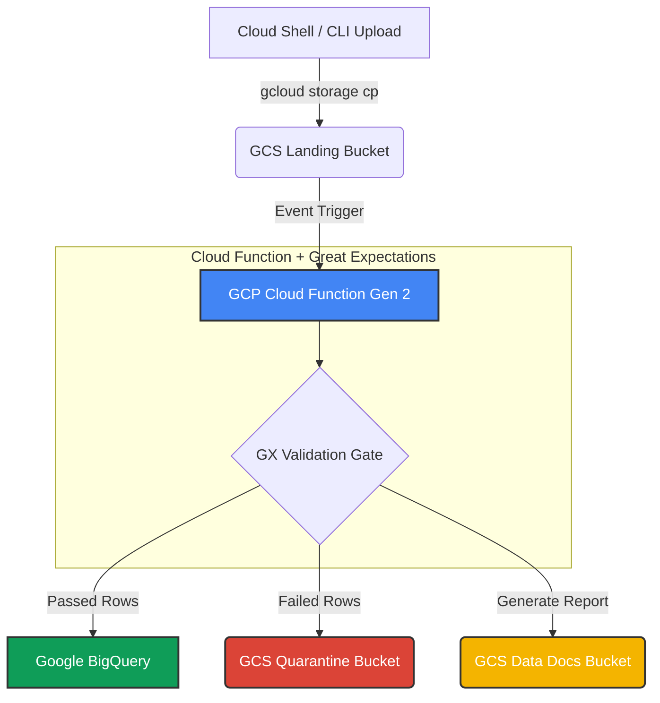

# Serverless Data Quality Firewall (GCP & Great Expectations)

An event-driven, serverless data validation pipeline built on Google Cloud Platform (GCP) using the Great Expectations (GX) Fluent API. 
This framework intercepts incoming production datasets, programmatically audits them against strict schema and business logic, 
and executes automated row-level quarantine routing to prevent downstream database corruption.

---

## Architecture Overview



### Data Flow Breakdown

* **Ingestion Trigger:** A user or automated process uploads a raw JSON/CSV data file into the `landing-bucket` via Cloud Shell or API.
* **Event-Driven Computation:** The file upload triggers a Gen 2 Cloud Function running a native Python environment.
* **In-Memory Validation:** The Cloud Function loads the payload using Great Expectations to run predefined assertion suites (e.g., type checking, value boundaries, null checks).
* **Row-Level Splitting:** * **Clean Records:** Bypass quarantine and are immediately appended into production **BigQuery** tables.
  * **Corrupted Records:** Are isolated and written into the `quarantine-bucket` as standalone error logs.
* **Observability:** Complete HTML data audit trails (Data Docs) are generated dynamically and saved to a web-hosted GCS bucket.

## Key Features

* **Fail-Fast & Zero Downtime:** Intercepts invalid values (e.g., negative financial amounts, missing primary IDs) before database compilation, avoiding expensive 400-level write rejections.
* **Non-Blocking Ingestion:** Partial file failures do not stop healthy data processing. Corrupted rows are peeled off seamlessly while good data continues streaming downstream.
* **Serverless Cost-Efficiency:** Completely idle infrastructure costs $0. Computing resources scale up instantly upon file landing and tear down immediately after validation.

---

## Deployment & Local Testing (Via Cloud Shell)

### 1. Initialize Storage Environments
```bash
# Create buckets for pipeline landing, isolation, and documentation
gcloud storage buckets create gs://your-landing-bucket-name
gcloud storage buckets create gs://your-quarantine-bucket-name
gcloud storage buckets create gs://your-datadocs-bucket-name
```

### 2. Trigger the Firewall Pipeline
To simulate a real production data breach, deploy the function and upload the malformed sample file via Cloud Shell:
```bash
gcloud storage cp sample_data/dirty_data.json gs://your-landing-bucket-name/
```

### 3. Verify Operational Isolation
* Check your **GCS Quarantine Bucket** to see the extracted malformed row logs.
* Query your **BigQuery Production Table** to verify clean, validated rows were committed safely without experiencing pipeline downtime.
